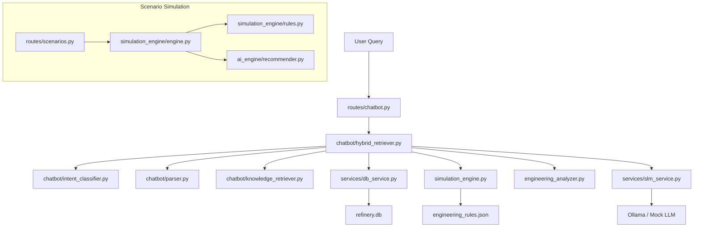

# PROJECT ANALYSIS REPORT — RDIS Refinery Decision Intelligence System

## 1. Current Architecture



### Key Components

| Component | File | Purpose |
|-----------|------|---------|
| Intent Classifier | `chatbot/intent_classifier.py` | Routes queries to KNOWLEDGE, CURRENT_DATA, ANALYSIS, or SIMULATION |
| Query Parser | `chatbot/parser.py` | Extracts unit_code, parameter, intent from NL queries |
| Hybrid Retriever | `chatbot/hybrid_retriever.py` | Main orchestrator — fetches DB data, runs simulation engine, builds LLM prompts |
| Simulation Engine V2 | `simulation_engine.py` | Estimates parameter changes using scaling formulas + engineering_rules.json |
| Engineering Rules | `engineering_rules.json` | Defines bounds, thresholds, and limits per unit (CDU, VDU, FCC, Hydrotreater, Storage Terminal) |
| SLM Service | `services/slm_service.py` | Sends prompts to Ollama/Mock LLM with formatting constraints |
| Response Validator | `response_validator.py` | Validates LLM responses (forbidden phrases, word count, section headers) |
| DB Service | `services/db_service.py` | SQLAlchemy queries against `refinery.db` |

---

## 2. Data Flow

1. **User query** enters `get_hybrid_chatbot_response()` in `hybrid_retriever.py`
2. **Intent detection** classifies as SIMULATION / ANALYSIS / CURRENT_DATA / KNOWLEDGE
3. For **SIMULATION** intent:
   - Identify unit (CDU, VDU, FCC, etc.)
   - Fetch latest DB values via `db_service.get_latest_operational_data()`
   - Parse numeric changes from query text (regex-based)
   - Call `estimate_parameters(unit, changes, current_values)` from `simulation_engine.py`
   - Build a prompt with Current/Target/Adjustments sections
   - Send prompt to SLM (Ollama or Mock)
   - Return formatted response
4. **Response** is logged to `chatbot_logs` table

---

## 3. Simulation Workflow (for chatbot hypothetical queries)

```
User: "If CDU flow rate increases to 6000 BPD"
  ↓
Intent: SIMULATION
  ↓
Unit: CDU
  ↓
Fetch latest DB: throughput=95000, flow_rate=3767, temperature=702, pressure=32.64
  ↓
Parse changes: throughput_bpd = 6000 (from user query)
  ↓
estimate_parameters(CDU, {throughput_bpd: 6000}, {throughput: 95000, ...})
  ↓
flow_ratio = 6000 / 95000 = 0.063   ← WRONG! ratio < 1 massively
  ↓
All scaling uses this broken ratio
  ↓
LLM receives nonsensical data → nonsensical output
```

---

## 4. Unit Inconsistencies — ROOT CAUSE IDENTIFIED

### The Core Problem: `throughput` vs `flow_rate` confusion

The database schema has TWO distinct flow-related fields:

| Field | DB Column | Actual Meaning | Stored Unit | Typical CDU Value |
|-------|-----------|----------------|-------------|-------------------|
| `throughput` | `operational_history.throughput` | Total processed crude volume | BPD | 73,000 – 95,000 |
| `flow_rate` | `operational_history.flow_rate` | Instantaneous volumetric flow | BPH (≈throughput/24) | 2,900 – 4,000 |

**The simulation engine uses `throughput` (BPD value of 95,000) as the baseline**, but when the user says "flow rate increases to 6000 BPD", the system sets `throughput_bpd = 6000` which is:
- Far LOWER than the current throughput of 95,000 BPD
- This creates `flow_ratio = 6000/95000 = 0.063` — a 94% reduction
- Result: massive nonsensical scaling

### What should happen:
- When user says "flow rate to 6000 BPD", the system should use `flow_rate` field (currently ~3767) as the baseline
- The target of 6000 BPD should be compared against flow_rate=3767, giving flow_ratio = 1.59 (59% increase)
- OR, convert the "6000 BPD" intent to equivalent throughput change

### Additional Unit Issues Found

| Field | CDU Value | VDU Value | FCC Value | Hydrotreater | Storage Terminal |
|-------|-----------|-----------|-----------|--------------|-----------------|
| throughput | 95,000 BPD | 39,748 BPD | 27,760 BPD | 16,903 BPD | 108,134 BPD |
| flow_rate | 3,767 BPH | 1,596 BPH | 1,155 BPH | 730 BPH | 4,468 BPH |
| temperature | 702°F | 767°F | 1,003°F | 691°F | 77°F |
| pressure | 32.64 psi | 1.5 psi | 37.91 psi | 777.84 psi | 20 psi |
| energy | 250 MWh | 180 MWh | 246 MWh | 103 MWh | 22 MWh |

**Observation**: `flow_rate ≈ throughput / 24` confirming flow_rate is in BPH (barrels per hour).

### Units in engineering_rules.json vs simulation_engine.py

| Parameter | engineering_rules.json key | Unit in JSON | simulation_engine.py assumes |
|-----------|---------------------------|-------------|------------------------------|
| Temperature (CDU) | `temperature_F` | °F | °F ✓ |
| Pressure (CDU) | `pressure_psi` | psi | psi ✓ |
| Throughput | `throughput_bpd` | BPD | BPD ✓ |
| Temperature (VDU) | Missing explicit key | N/A | Uses generic °F |
| Vacuum (VDU) | `vacuum_inHg` | inHg | inHg ✓ |

**Units are internally consistent in °F and psi.** The user's request mentions °C and bar, but the database stores °F and psi. Response formatting should present in user's preferred units.

---

## 5. Root Causes of Unrealistic Simulation Outputs

### Root Cause 1: Throughput/Flow Rate Confusion
- `hybrid_retriever.py` line 554: `base_throughput = current_values.get('throughput')` → This gets the BPD throughput (95,000 for CDU)
- When user says "flow rate increases to 6000", the system parses 6000 and sets `changes['throughput_bpd'] = 6000`
- But 6000 is a **flow_rate** value (BPH), not a throughput value (BPD)
- `flow_ratio = 6000 / 95000 = 0.063` → massively wrong

### Root Cause 2: CDU throughput exceeds engineering_rules.json bounds
- CDU actual throughput = 95,000 BPD
- engineering_rules.json max = 60,000 BPD
- This means `get_clamped_range()` always returns "Maximum Safe Limit Reached" for CDU
- The bounds in engineering_rules.json are too low for the actual database values

### Root Cause 3: Undifferentiated "flow" keyword
- `parser.py` maps "flow" to `parameter = "flow_rate"`
- But `hybrid_retriever.py` SIMULATION section maps "flow" to `throughput_bpd` change
- This creates confusion: the system can't tell if "flow rate" should modify `flow_rate` or `throughput`

### Root Cause 4: Response format includes consultant-style sections
- The prompt template in `hybrid_retriever.py` lines 699-714 includes: "Economic Impact", "Confidence Level"
- `slm_service.py` line 68 mandates: "Current Conditions, Target Conditions, Parameter Adjustments, Expected Changes, Operational Risks, Economic Impact, Recommendations"
- User wants: Current Conditions, Target Conditions, Parameter Adjustments, Expected Changes, Operational Risks, Recommendations — NO Economic Impact unless asked

### Root Cause 5: No sanity checks on simulation inputs/outputs
- No validation that target throughput is within physical bounds
- No check that flow_ratio is within reasonable range (0.5 – 2.0)
- No clamping of unrealistic energy percentage changes
- `simulation_engine.py` line 140 references undefined `c_utilization` variable (NameError for Storage Terminal)

### Root Cause 6: Current conditions display uses throughput as "Flow"
- `hybrid_retriever.py` line 647: `f"Flow: {current_values.get('throughput')} BPD"` 
- This labels throughput as "Flow" — confusing for engineers
- Should display both: Flow Rate (BPH) and Throughput (BPD) with correct labels

---

## Summary of Required Changes

1. **Fix throughput vs flow_rate distinction** — parse user intent correctly
2. **Update engineering_rules.json** — align bounds with actual DB data ranges
3. **Add sanity checks** — clamp flow_ratio, reject unrealistic values
4. **Fix response format** — use engineer-style sections, remove Economic Impact by default
5. **Fix current conditions display** — use actual field names with correct units
6. **Fix Storage Terminal NameError** — `c_utilization` undefined
7. **Keep responses under 120 words** — short, operational, actionable
