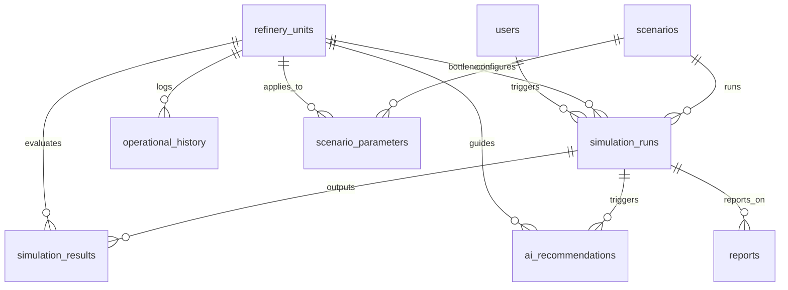

# RDIS Database Design Documentation

This document describes the schema architecture for the Refinery Decision Intelligence System (RDIS), built on SQLite.

## Database Philosophy
RDIS implements a relational, relational-first database structure in SQLite. This local storage acts as:
1. The historical logging database of refinery operational variables.
2. The configuration ledger mapping scenario templates and their parameter rules.
3. The tracking registry for simulation runs, comparisons, and generated AI recommendations.
4. The system logs recording hybrid chatbot conversations.

---

## Schema Overview & Entity Relationship

---

## Tables Dictionary

### 1. `users`
Represents refinery personnel operating the console.
- `id` (INTEGER, Primary Key, Auto-Increment)
- `username` (TEXT, Unique, Not Null)
- `role` (TEXT, Default 'Operator')
- `created_at` (DATETIME, Default Current Timestamp)

### 2. `refinery_units`
Records the 5 specific operational units defined in the system scope.
- `id` (INTEGER, Primary Key, Auto-Increment)
- `name` (TEXT, Unique, Not Null)
- `code` (TEXT, Unique, Not Null) - e.g. `CDU`, `VDU`, `FCC`, `Hydrotreater`, `Storage Terminal`
- `description` (TEXT)
- `throughput_capacity` (REAL, Not Null) - Hydraulic design limits (bbl/day)
- `status` (TEXT, Default 'Active') - `Active`, `Maintenance`, `Shutdown`
- `created_at` (DATETIME)

### 3. `operational_history`
Chronological database records of operational parameters (200 records per unit, total 1000+).
- `id` (INTEGER, Primary Key, Auto-Increment)
- `unit_id` (INTEGER, Foreign Key referencing `refinery_units(id)`)
- `throughput` (REAL, Not Null) - Processing rate (bbl/day)
- `pressure` (REAL, Not Null) - Vessel pressure (psi)
- `temperature` (REAL, Not Null) - Unit thermal index (°F)
- `flow_rate` (REAL, Not Null) - Process flow rate (bbl/hr)
- `downtime` (REAL, Default 0.0) - Cumulative offline hours in the interval
- `yield` (REAL, Not Null) - Distillate yield percentage (%)
- `energy_consumption` (REAL, Not Null) - Power/thermal utility draw (MMBtu/hr)
- `timestamp` (DATETIME, Not Null)

### 4. `scenarios`
Declaration of simulation scenarios.
- `id` (INTEGER, Primary Key)
- `name` (TEXT, Not Null)
- `type` (TEXT, Not Null) - `FCC_SHUTDOWN`, `THROUGHPUT_INCREASE`, etc.
- `description` (TEXT)
- `created_at` (DATETIME)

### 5. `scenario_parameters`
Defines operational rules/deltas to apply to parameters during simulation execution.
- `id` (INTEGER, Primary Key)
- `scenario_id` (INTEGER, Foreign Key referencing `scenarios(id)`)
- `unit_id` (INTEGER, Foreign Key referencing `refinery_units(id)`)
- `parameter_name` (TEXT, Not Null) - target parameter field
- `value_change_type` (TEXT, Not Null) - `PERCENTAGE` or `ABSOLUTE`
- `value_change` (REAL, Not Null) - scaling factor (e.g. +0.10 for +10%)

### 6. `simulation_runs`
Records run metadata, risk assessments, and diagnosed bottlenecks.
- `id` (INTEGER, Primary Key)
- `scenario_id` (INTEGER, Foreign Key referencing `scenarios(id)`)
- `user_id` (INTEGER, Foreign Key referencing `users(id)`)
- `run_timestamp` (DATETIME)
- `risk_score` (INTEGER, Not Null, Range 0-100)
- `bottleneck_unit_id` (INTEGER, Foreign Key referencing `refinery_units(id)`)

### 7. `simulation_results`
Stores detailed before-and-after values for parameters in each run.
- `id` (INTEGER, Primary Key)
- `run_id` (INTEGER, Foreign Key referencing `simulation_runs(id)`)
- `unit_id` (INTEGER, Foreign Key referencing `refinery_units(id)`)
- `parameter_name` (TEXT, Not Null)
- `before_value` (REAL, Not Null)
- `after_value` (REAL, Not Null)

### 8. `ai_recommendations`
Stores context-specific operational recommendations mapped to simulation outcomes.
- `id` (INTEGER, Primary Key)
- `run_id` (INTEGER, Foreign Key referencing `simulation_runs(id)`)
- `unit_id` (INTEGER, Foreign Key referencing `refinery_units(id)`)
- `recommendation_text` (TEXT, Not Null)
- `priority` (TEXT, Range: `High`, `Medium`, `Low`)

### 9. `chatbot_logs`
Logs of user chats, database context dumps, and system responses.
- `id` (INTEGER, Primary Key)
- `user_query` (TEXT, Not Null)
- `system_response` (TEXT, Not Null)
- `retrieved_data_used` (TEXT) - JSON dump of SQLite metrics extracted
- `llm_called` (INTEGER, Default 0) - Boolean indicator

### 10. `reports`
Metadata cataloging generated reports files.
- `id` (INTEGER, Primary Key)
- `name` (TEXT, Not Null)
- `format` (TEXT, Not Null) - `PDF` or `CSV`
- `file_path` (TEXT, Not Null)
- `run_id` (INTEGER)
- `created_at` (DATETIME)

---

## Performance Indexes
To speed up data retrieval in standard dashboard charts and paginated tables, the schema contains these specific indexes:
- `idx_history_unit_time`: B-Tree index on `operational_history(unit_id, timestamp)` to speed up time-series chart requests.
- `idx_simulation_runs_scenario`: Index on `simulation_runs(scenario_id)` for aggregations.
- `idx_simulation_results_run`: Index on `simulation_results(run_id)` for retrieving comparisons.
- `idx_recommendations_run`: Index on `ai_recommendations(run_id)`.
